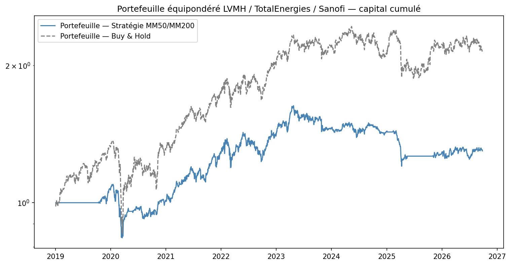
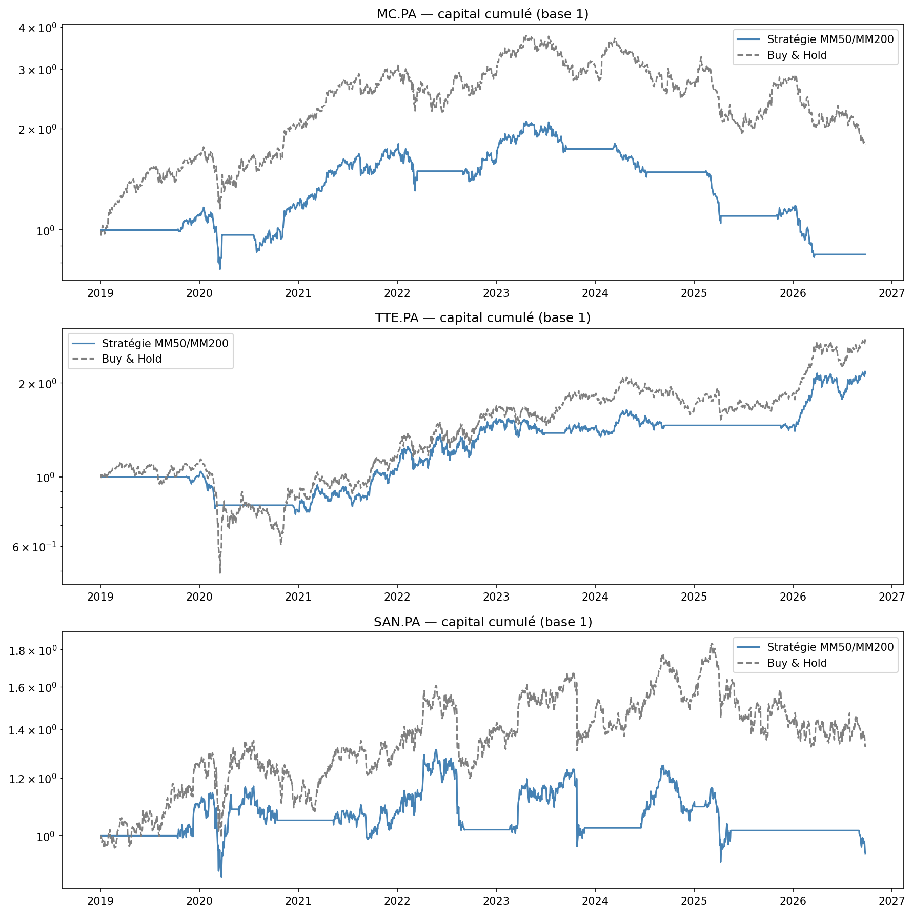
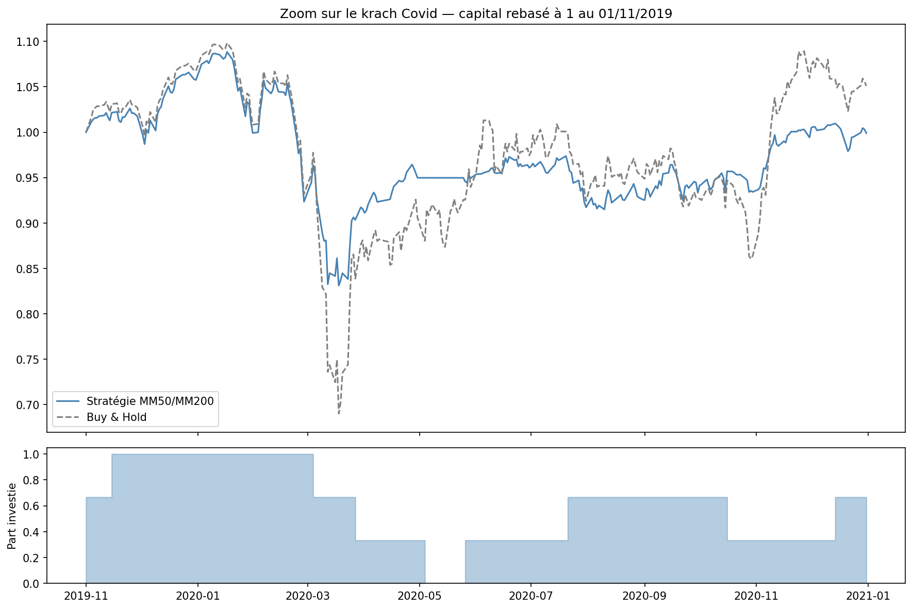

# Backtesting d'une Stratégie de Trading — Momentum (Croisement de Moyennes Mobiles)

Test d'une stratégie de trend-following (croisement de moyennes mobiles 50/200 jours) sur un portefeuille équipondéré de 3 valeurs du CAC 40 (LVMH, TotalEnergies, Sanofi), comparée à une approche passive buy & hold, sur 6 ans de données réelles (2019-2026).

## Le projet

Une stratégie de trading qui "gagne" sur un backtest ne veut rien dire si on ne comprend pas *pourquoi* elle gagne (ou perd), et dans quelles conditions de marché. Ce projet implémente une règle de trend-following classique — rester investi quand la moyenne mobile 50 jours est au-dessus de la moyenne mobile 200 jours ("golden cross"), sortir en cash sinon ("death cross") — et la teste honnêtement, sans chercher à l'ajuster a posteriori pour qu'elle performe bien.

## Résultats clés

| | CAGR Stratégie | CAGR Buy & Hold | Sharpe Stratégie | Sharpe Buy & Hold | Max Drawdown Stratégie | Max Drawdown Buy & Hold |
|---|---|---|---|---|---|---|
| LVMH | -2.10% | 7.66% | 0.00 | 0.40 | -60.40% | -52.61% |
| TotalEnergies | 10.22% | 13.53% | 0.60 | 0.59 | -27.04% | -56.79% |
| Sanofi | -0.71% | 3.63% | 0.05 | 0.27 | -29.83% | -27.80% |
| **Portefeuille équipondéré** | **3.38%** | **10.15%** | **0.32** | **0.59** | **-26.29%** | **-37.17%** |

**Sur ce panier de 3 valeurs, la stratégie ne bat pas le buy & hold** — ni en rendement, ni en rendement ajusté du risque (Sharpe 0,32 contre 0,59) — malgré une volatilité et un drawdown nettement réduits. Seule TotalEnergies fait exception.

## Pourquoi ça ne marche pas ici : le cas du krach Covid

Le zoom sur mars 2020 montre le mécanisme : une moyenne mobile 200 jours réagit avec retard à une chute aussi rapide que le krach Covid. La stratégie sort du marché après l'essentiel de la baisse, puis rentre après une partie du rebond — elle cumule une partie du risque baissier et manque une partie de la hausse qui suit. C'est l'inverse d'une baisse lente et prolongée (type 2008), où une moyenne mobile a le temps de suivre la tendance et protège réellement.

## Fichiers

| Fichier | Description |
|---|---|
| `Backtesting_Momentum_LVMH_TTE_SAN.ipynb` | Notebook Python complet (récupération des données, stratégie, métriques, visualisations) |
| `capital_cumule_portefeuille.png` / `capital_cumule_par_action.png` / `zoom_covid.png` | Visualisations de synthèse |
| `prix_actions.csv`, `metriques_par_action.csv`, `metriques_portefeuille.csv` | Données et résultats exportés |

## Outils

Python (pandas, numpy, yfinance, matplotlib), Google Colab.

## Limites et pistes d'amélioration

- Seulement 3 actions, insuffisamment diversifiées (LVMH et Sanofi réagissent toutes deux fortement à la conjoncture macro mondiale) — un panier plus large ou un indice lisserait les faux signaux individuels
- Le cash est supposé rémunéré à 0%, et aucun frais de transaction n'est modélisé ici (contrairement au projet VaR, où un coût par aller-retour avait été intégré)
- Les fenêtres de moyennes mobiles (50/200 jours) viennent de la littérature et ne sont volontairement pas optimisées sur ces 3 actions, pour éviter le sur-ajustement — mais cela n'exclut pas qu'un autre réglage, ou un filtre de confirmation du signal, donne un résultat différent sur cette période précise

---
*Projet réalisé dans le cadre d'une recherche de stage/alternance en finance de marché (gestion des risques, front office, produits structurés).*
